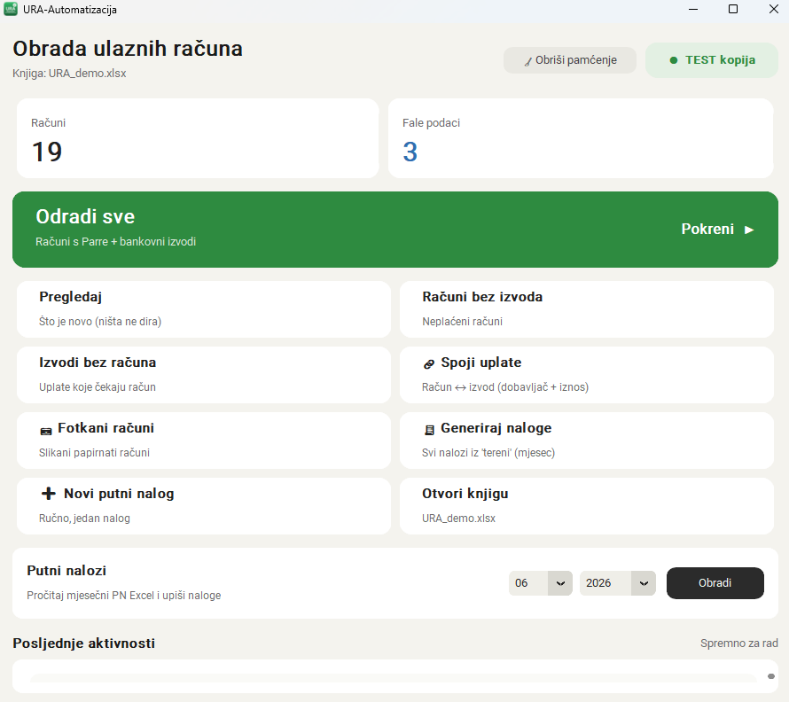
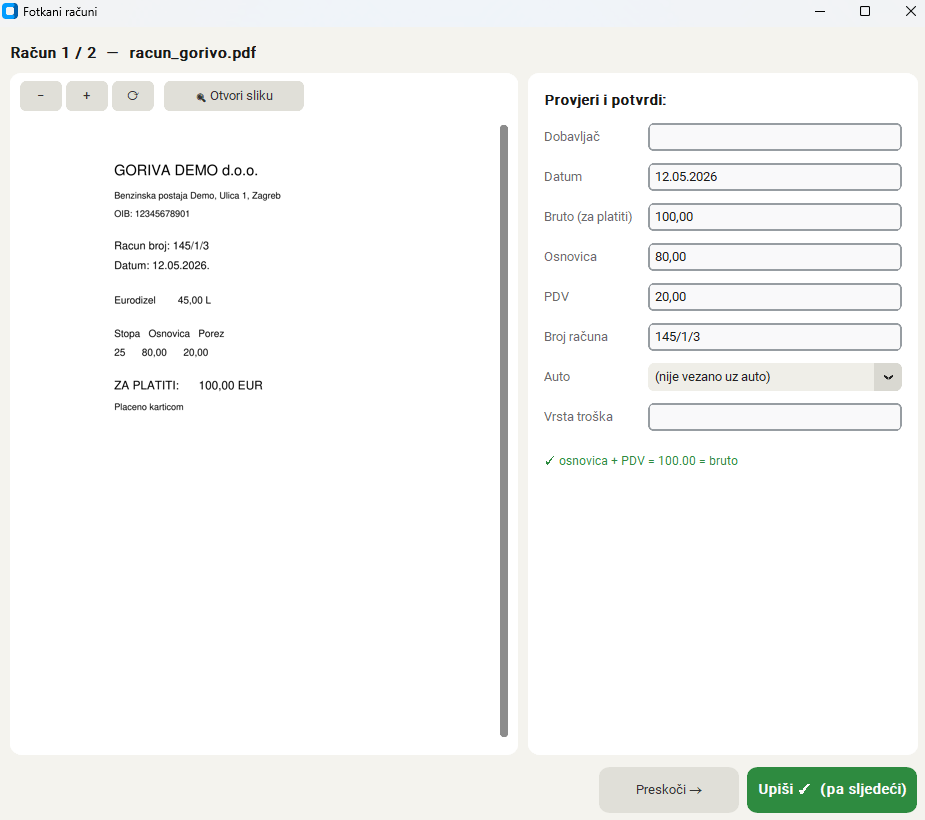
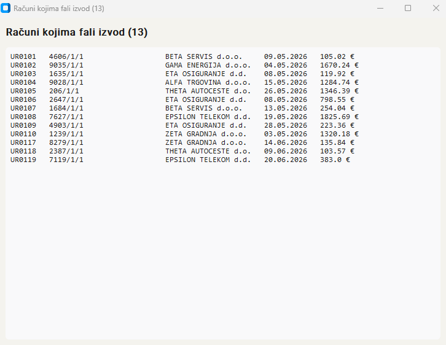
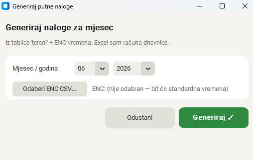

# URA — Automatizacija obrade ulaznih računa

Desktop aplikacija (Python) koja automatizira knjiženje ulaznih računa u
administraciji: povuče e-račune iz vanjskog servisa, poveže ih s bankovnim
izvodima i pripremi za upis u knjigu — uz pregled i potvrdu prije svakog upisa.

> **Napomena:** Ovo je *portfolio* verzija. Radi na **potpuno izmišljenim demo
> podacima** i ne sadrži nikakve stvarne podatke ni tajne. Sve putanje i ključevi
> postavljaju se kroz `.env` (vidi `.env.example`).

---

## Problem

U manjoj firmi obrada ulaznih računa je dugotrajna i sklona greškama:

- računi stižu iz više izvora (e-računi preko servisa, PDF-ovi dobavljača, papirnati/fiskalni računi),
- svaki treba upisati u knjigu s ispravnim podacima (dobavljač, iznosi, PDV, vrsta troška),
- treba ih povezati s **bankovnim izvodima** da se zna što je plaćeno, a što ne,
- isti račun zna stići i prije i poslije uplate, pa je lako napraviti **duplikat** ili promašiti vezu.

Sve se to radilo ručno, stavku po stavku.

## Rješenje

Aplikacija to objedinjuje u jedan tijek „pregledaj → potvrdi → upiši":

1. **Dohvat** novih ulaznih e-računa iz vanjskog računovodstvenog servisa (REST API).
2. **Čitanje dokumenata** — iz PDF-a/e-računa izvuče broj, datum, dobavljača, iznose i PDV; za fotografirane papirnate račune koristi **OCR**.
3. **Povezivanje s bankovnim izvodima** — parsira PDF izvode više banaka i poveže uplate s odgovarajućim računima.
4. **Priprema upisa** u Excel knjigu, uz **ekran za potvrdu** (✓/✗ po stavci) prije nego se išta zapiše.
5. **Izvještaji** — npr. „računi kojima fali izvod" i „uplate kojima fali račun".
6. **Putni nalozi** — automatsko generiranje mjesečnih naloga iz tablice terena.

Knjiga (Excel) ostaje **izvor istine** — aplikacija je puni i čuva izvorno
oblikovanje, formule i makroe; ne preuzima podatke u zasebnu bazu.

## Ključne funkcije

- 📥 **Integracija s vanjskim API-jem** (e-računi) uz sigurno čuvanje tokena izvan koda.
- 📄 **Parsiranje PDF-a** (računi i bankovni izvodi različitih formata).
- 🔎 **Višestupanjsko povezivanje zapisa (fuzzy matching):** primarno po identifikatoru
  dokumenta, a kad se ne poklapa — po kombinaciji **iznosa, datuma (uz toleranciju) i
  usporedbe naziva** (otpornoj na kratice, dijakritike i različite zapise istog broja).
- ⏳ **Odgođeno povezivanje (deferred matching):** ako uplata stigne prije računa,
  zapis „čeka" i automatski se dopuni kad račun stigne — bez duplikata.
- 🧾 **OCR fotografiranih računa** (predpopuna podataka, korisnik potvrđuje).
- 🖥️ **Moderan GUI** s nadzornom pločom (brojčani pregledi), ekranom za potvrdu i izvještajima.
- 🧯 **Sigurnosne kočnice:** automatski backup prije svakog pisanja, „samo prikaži"
  način rada, i pamćenje već obrađenog (ručno obrisani redovi se ne vraćaju).

## Tehnologije

| Područje | Alat |
|---|---|
| Jezik | Python 3 |
| GUI | CustomTkinter |
| Excel | openpyxl, xlwings |
| PDF | pdfplumber, pypdf, PyMuPDF |
| OCR | EasyOCR (deep-learning, primarno) + Tesseract (rezerva), Pillow |
| Integracija | REST API (requests), konfiguracija preko `.env` |
| Usporedba teksta | RapidFuzz |

**Arhitektura:** logika je odvojena od prikaza — `main.py` (orkestracija) i moduli
u `src/` (svaki za jednu odgovornost: API, PDF, izvodi, povezivanje, Excel,
izvještaji…), dok je `gui.py` samo sučelje. Sve putanje i sklopke su u `config.py`.

## Rezultat

- Obrada koja je trajala sate svodi se na **par minuta uz pregled i potvrdu**.
- Reda veličine **~200 dokumenata mjesečno** obrađuje se poluautomatski.
- Znatno manje ručnog prepisivanja i **manje grešaka/duplikata**.
- Aplikaciju može koristiti i zamjena bez tehničkog znanja (dvoklik, jasni gumbi).

---

## Pokretanje (demo)

Aplikacija je zadano u **DEMO načinu** i radi na izmišljenim podacima — bez servera i tokena.

```bash
# 1) virtualno okruženje + biblioteke
python -m venv .venv
.venv\Scripts\activate
pip install -r requirements.txt

# 2) generiraj izmišljene demo podatke
python demo/generiraj_demo.py

# 3) pokreni aplikaciju
python gui.py
```

> Za OCR fotografiranih računa koristi se **EasyOCR** (instalira se preko
> `requirements.txt`; pri prvom pokretanju skine jezični model). Opcionalno se kao
> rezerva može instalirati i **Tesseract**. Ostatak aplikacije radi i bez OCR-a.

Za pravi rad: kopiraj `.env.example` u `.env`, postavi `DEMO=0` i upiši stvarne
putanje/ključeve. Ništa od toga nije u kodu.

## Privatnost i sigurnost

- Nikakvi stvarni podaci, tajne ni interne putanje nisu u repozitoriju.
- Tokeni i lozinke se učitavaju iz `.env` (koji se ne dijeli — vidi `.gitignore`).
- Demo podaci su nasumično generirani i fiktivni.

## Screenshotovi

**Nadzorna ploča**



**Ekran za potvrdu (fotografirani/PDF račun → predpopunjena polja)**



**Izvještaj (računi kojima fali izvod) i generiranje putnih naloga**





---

*Projekt sam osmislila i izradila koristeći AI-alat (Claude Code) kao programskog
pomoćnika — od ideje i analize stvarnog problema do gotove aplikacije koju koristim u praksi.*
